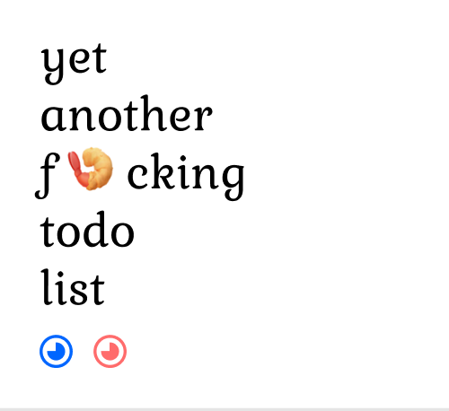
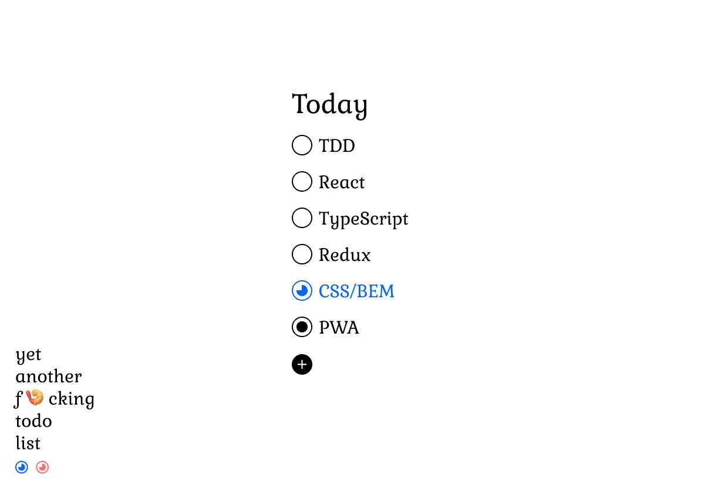

# Yet another f 🍤 cking todo list

This project contains the materials created during the [yaftl livestream](https://www.twitch.tv/rafpast), where we pick a small, 🦐-sized problem, solve it using TDD and learn a bit about the tech and design on the way.

Feel free to clone it, break it or build the project yourself!

## Goal

We want to build a small app that looks (roughly) like this:

Got any questions or topics to cover? Add an issue and I'll see what can be done.

I don't have a job yet, so I might as well make another shrimpin' todo list with friends and learn something new.

Peace, love and pixels,
R.
